### 系统调查

近年来，全球范围内涌现出了一股移动支付热潮。这激动人心的趋势主要源于科技的快速进步以及智能手机的广泛普及。移动支付作为一种便捷、高效的支付方式，正深刻地改变着人们的消费观念和金融交易方式。

这场热潮的核心特征在于，随着智能手机技术的不断提升和价格的下降，越来越多的人能够方便地拥有和使用智能手机。这为移动支付提供了强大的支持，使得用户可以随时随地进行数字化支付。互联网和移动互联网的广泛覆盖为用户提供了更多数字支付的便利途径，推动了移动支付的普及。

支付技术方面的创新也是移动支付热潮的关键推动力。诸如QR码支付、NFC技术、生物识别等新兴技术的引入，不仅提高了支付的安全性，也使支付变得更加便捷。随着生活节奏的加快，人们对支付方式的需求逐渐变化，而移动支付以其实时性和方便性迎合了这一需求，成为人们生活中的首选支付方式之一。

在这个移动支付热潮的大背景下，越来越多的企业和创业者决定投身于数字支付领域，致力于构建更加智能、安全、便捷的线上交易系统。这种趋势也催生了电子钱包系统等数字化支付解决方案的迅速发展和广泛应用，为用户提供了全新的支付体验。

基于近年兴起的移动支付热潮，我们决定实现一个简单的线上交易系统——电子钱包系统。通过这一系统，用户可以方便快捷地进行各类交易，包括购物、转账、充值等，将传统纸币的支付方式与现代科技相结合。电子钱包系统的设计旨在提供安全、高效的支付体验，同时促进数字化经济的发展。系统将采用先进的加密技术，确保用户信息和交易数据的安全性，为用户创造一个便捷、可信赖的移动支付环境。

### 系统分析

本电子钱包系统通过结合客户和经理两个主要角色，实现了多层次的功能。对于客户，系统提供了方便的存款、取款、交易等基础操作，并通过短信验证码验证机制确保交易的安全性。客户还可以方便地查看自己的交易记录，实时了解账户状态。对于经理，系统提供了全面的客户管理功能，包括开户、查询客户信息、提升交易限额等。经理可以通过系统直观地查看当日和本月的流水，为管理决策提供了重要参考。

系统设计还包括通用功能，如登录和手机号验证，以确保系统的安全性和用户身份的准确性。通过这些功能，电子钱包系统将为用户提供一体化的数字支付解决方案，促使更多人加入移动支付的使用群体。

 ### 系统设计

本电子钱包系统通过结合客户和经理两个主要角色，实现了多层次的功能。对于客户，系统提供了方便的存款、取款、交易等基础操作，并通过短信验证码验证机制确保交易的安全性。客户还可以方便地查看自己的交易记录，实时了解账户状态。对于经理，系统提供了全面的客户管理功能，包括开户、查询客户信息、提升交易限额等。经理可以通过系统直观地查看当日和本月的流水，为管理决策提供了重要参考。

1. **客户功能**：
   - 存钱
   - 取钱
   - 交易
   - 查看账户的交易记录
   
2. **经理功能**：

   - 管理客户（开户、查询、提升限额、注销）
   - 月流水在主页展示

3. **通用功能**：

   - 登录

   - 手机号验证

### 数据库设计

#### 需求分析
##### 数据对象：
根据电子钱包的流程，客户通过取钱存钱转账等操作实现流程。流程图如下：
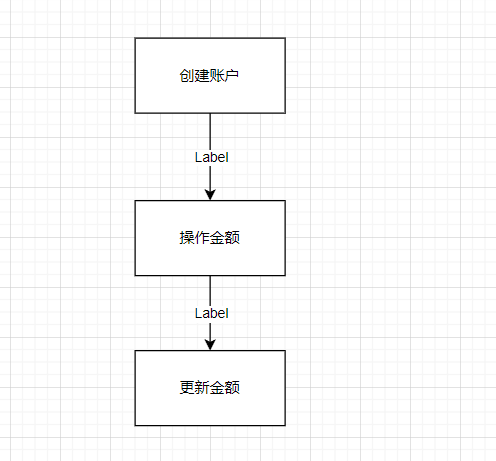
可以根据流程图抽象出数据对象：
账户，关联经理和普通账户。
经理，本身角色。
顾客，本身角色。
交易信息，记录交易信息。

#### ER图设计
#### 实体集

1. **账户**：
   - 账号
   - 密码
   - 手机号
2. **客户**：
   - 客户ID
   - 姓名
   - 余额
   - 限额
3. **经理**：
   - 经理ID
   - 姓名
4. **交易**：
   - 交易ID
   - 金额
   - 状态
   - 发起客户
   - 接收客户

#### 关系集

- 账户-客户：拥有

- 账户-经理：拥有

- 客户-交易：修改交易状态、修改时间

- 经理-交易：强制回退交易、修改时间

- 经理-客户：开户、销户、修改密码、修改限额

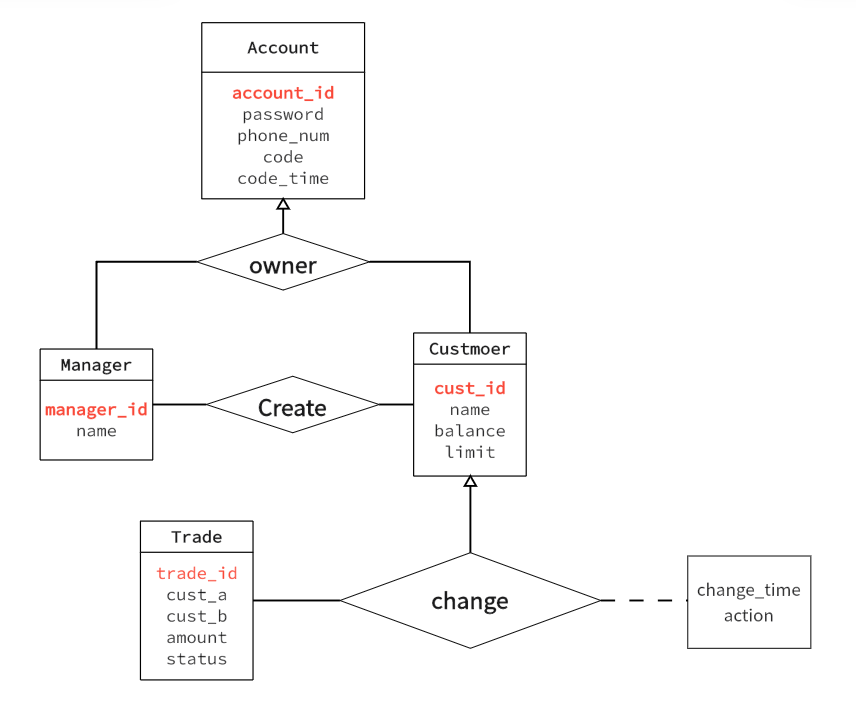

### 设计成表格如下

1. **account表：**
- `account_id`：账号标识码，随机生成的8位整数。
- `password`：账户密码，10个字符以内的字符串。
- `phone_num`：手机号，11位数字字符串。
- `code`：验证码。
- `code_time`：验证码发送时间。
2. **经理表（manager表）：**
- `manager_id`：客户ID，5位数字标识码，可能随机生成或按某种规则累计。
- `name`：客户姓名。
- `account_id`:外键，引用账号编号。
3. **客户表（customer表）：**
- `cust_id`：客户ID，5位数字标识码，可能随机生成或按某种规则累计。
- `name`：客户姓名。
- `balance`：账户余额，随着交易的发生而变化。
- `limit`：单笔交易的限额。
- `account_id`:外键，引用账号编号。
4. **交易表（trade表）：**
- `trade_id`：交易ID，15位数字标识码。
- `amount`：交易金额。
- `status`：交易状态，整数表示不同状态（0：待确认，1：已完成，2：未成功，3：数据错误）。
- `cust_a`：交易发起客户的ID，外键。
- `cust_b`：交易接收客户的ID，外键。
5. **change表：**
- `change_id`：修改记录ID。

- `change_time`：修改时间。

- `trade_id`：被修改的交易ID，外键。

- `cust_id`：客户ID，表明是哪个客户进行的修改。

- `action`：修改内容，整数0-4表示不同的修改动作（0：发起交易，1：接收交易，2：拒绝交易，3：撤销交易，4：数据错误）。

  这些表之间通过客户ID、账号等字段建立关系，以满足系统对客户、交易和修改记录的需求。

#### 范式分析：
  整个数据库为3NF，首先全部表格的主键只有一项且元素均是原子的，所以数据库为2NF，同时不存在传递依赖，password不能决定phone_num，客户表的非主属性也不存在，同理经理表，交易表和记录交易状态表也不存在。

#### 外键关系
   在表中标识了对应的外键关系，在数据库插入和更新中需要进行外键的约束检查。
   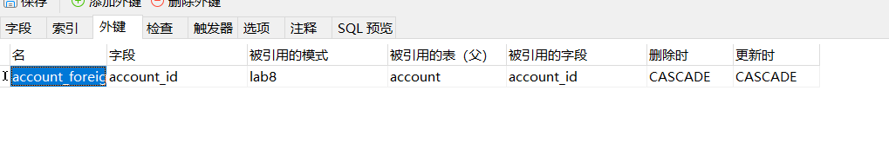

#### 物理层面：建立索引关系
   在各个表的主键建立索引，是每次查询更加高效，主键和其他表的主键（我引用的外键）有给出索引项，如下的一张表所示：
   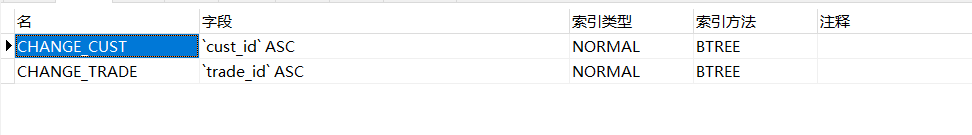
#### 触发器
   建立了两个触发器，设置了余额过小不能转账抛出异常，保证数据库一致性
   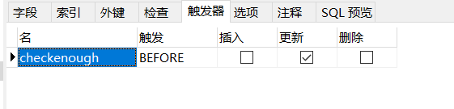
   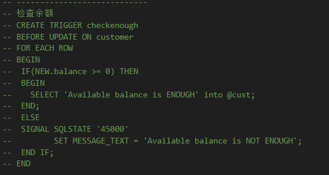

   和余额过少自动确认对方的转账，方便交易

   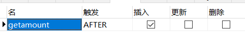
   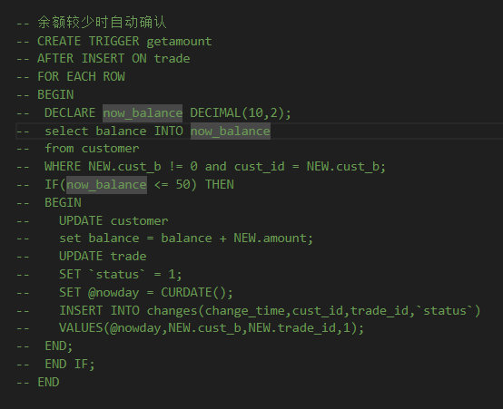

此外，在系统设计方面，我们充分考虑了用户友好性和操作便捷性。通过采用 Flask 进行前后端交互，我们实现了直观的GUI，并利用 HTML 和 Python 实现了各项功能。数据库的设计考虑了实际业务需求，采用了自增长列作为主键，确保了数据的唯一性。同时，我们通过触发器和权限的设置，增强了系统的安全性。

系统的一个特色是采用验证码，提高安全性。此外，我们通过交易发起函数实现了存款、取款和交易的一体化处理，简化了操作流程。最终，该电子钱包系统旨在提供一种便捷、安全、全面的数字金融服务，为用户提供更好的金融体验。

### 数据库创建和数据加载

通过设计好ER图之后生成的sql语句建立数据库，如下所示：

![image-20231228221024542]

![image-20231228221044691]

![image-20231228221114878]

在系统中随机生成的账户和密码ID如下：

![image-20231228221304928]

客户信息：

![image-20231228221324062]

经理信息：

![image-20231228221342982]

### 数据库应用软件的功能设计和开发

开发的后端主要函数如下所示：

登录函数：给定account、password，返回登录结果（-1：登录失败，账号不存在；0：登录失败，密码错误；1：登录成功）
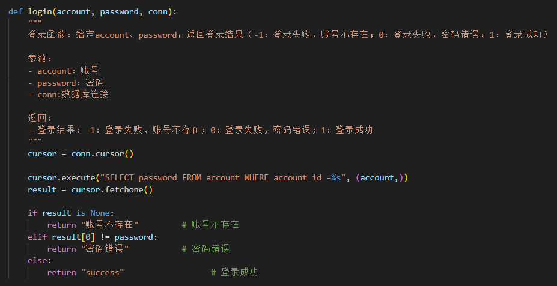

消息提醒函数：给定account，返回等待其确认的交易(即发给他且他未确认的交易)

 交易发起函数：给定发起客户、目标客户、金额，若目标客户不存在，金额超过发起客户单笔额度，交易发起失败，返回失败信息；否则发起成功，创建交易(注意创建交易、change元组)。
注意：存、取、交易都是通过这个函数实现的，存由‘系统’账户发起，客户接收；取由客户发起，‘系统’接收。
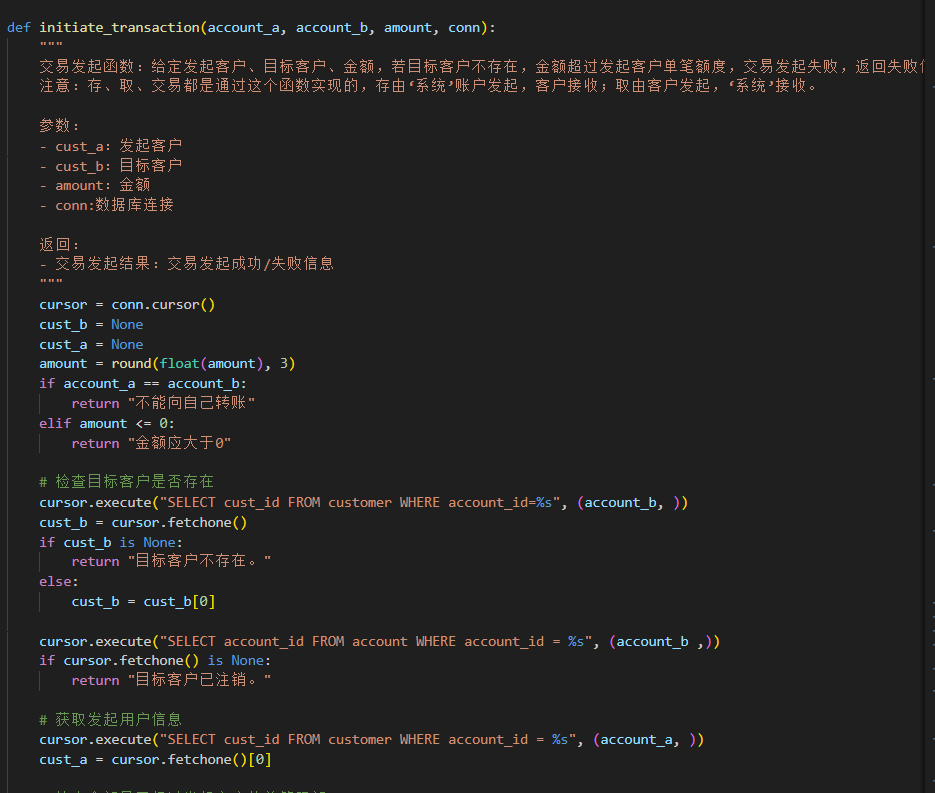

修改交易：给定客户、交易、操作(接收、撤销、拒绝)，修改数据库对应信息(注意同步余额、trade状态，增加change条目)
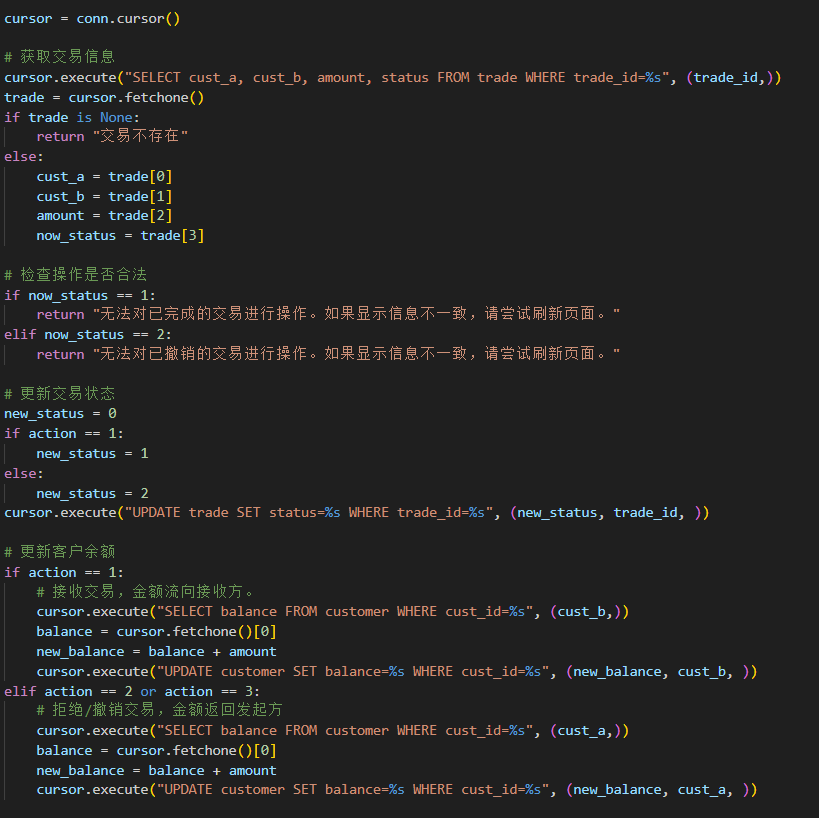
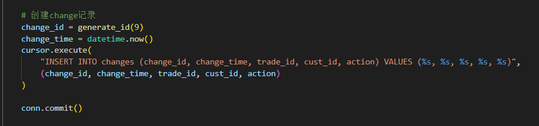

客户交易查询函数：给定客户账号，返回有关客户的所有交易（所有状态）。

流水查询函数：返回指定日期的流水
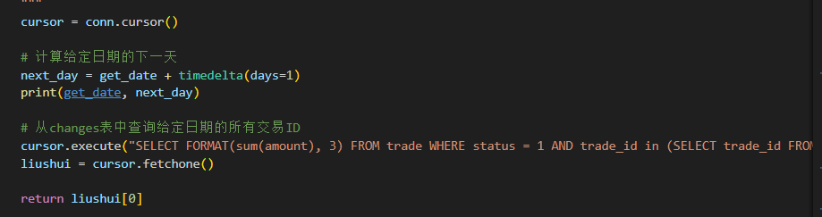

开户函数：给定姓名、手机号、密码，创建一个客户（创建账户，余额为0，默认限额）
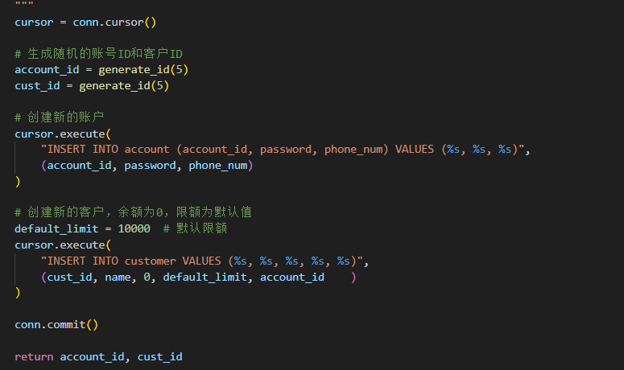

**开发的前端函数如下：**

### 数据库应用系统测试
按数据库的表项测试网站

### 分析设计和开发文档撰写
不知道干嘛的

### 应用软件、数据库和文档提交
不知道干嘛的

### 应用系统演示和汇报
演示功能
