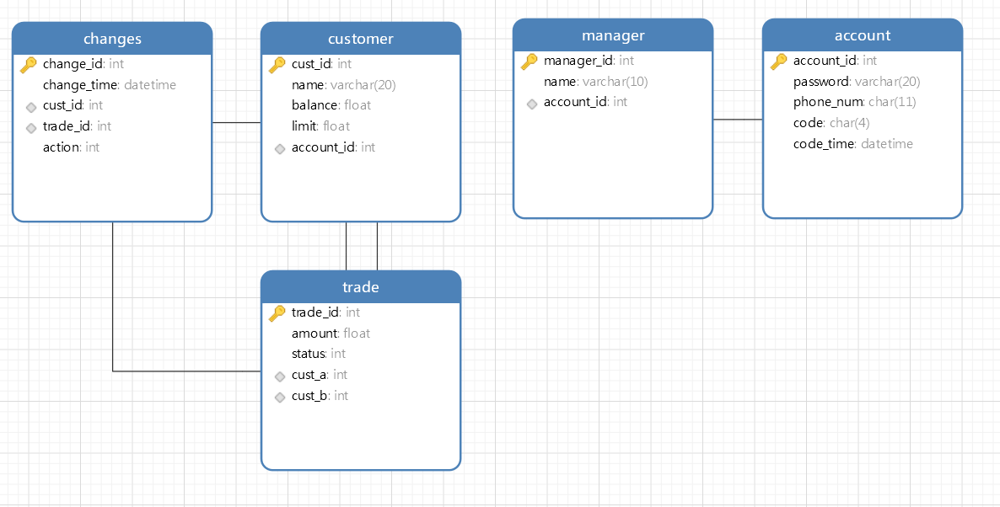

#### 主要实现功能

本电子钱包系统通过结合客户和经理两个主要角色，实现了多层次的功能。对于客户，系统提供了方便的存款、取款、交易等基础操作，并通过短信验证码验证机制确保交易的安全性。客户还可以方便地查看自己的交易记录，实时了解账户状态。对于经理，系统提供了全面的客户管理功能，包括开户、查询客户信息、提升交易限额等。经理可以通过系统直观地查看当日和本月的流水，为管理决策提供了重要参考。

1. **客户功能**：

   - 存钱
   - 取钱
   - 交易
   - 查看账户的交易记录

2. **经理功能**：

   - 管理客户（开户、查询、提升限额、注销）
   - 月流水在主页展示

3. **通用功能**：

   - 登录

   - 手机号验证

### 数据库设计

#### 需求分析
##### 数据对象：
根据电子钱包的流程，客户通过取钱存钱转账等操作实现流程。流程图如下：

可以根据流程图抽象出数据对象：
账户，关联经理和普通账户。
经理，本身角色。
顾客，本身角色。
交易信息，记录交易信息。

#### ER图设计
#### 实体集

1. **账户**：
   - 账号
   - 密码
   - 手机号
2. **客户**：
   - 客户ID
   - 姓名
   - 余额
   - 限额
3. **经理**：
   - 经理ID
   - 姓名
4. **交易**：
   - 交易ID
   - 金额
   - 状态
   - 发起客户
   - 接收客户

#### 关系集

- 账户-客户：拥有

- 账户-经理：拥有

- 客户-交易：修改交易状态、修改时间

- 经理-交易：强制回退交易、修改时间

- 经理-客户：开户、销户、修改密码、修改限额

### 设计成表格如下

1. **account表：**
- `account_id`：账号标识码，随机生成的8位整数。
- `password`：账户密码，10个字符以内的字符串。
- `phone_num`：手机号，11位数字字符串。
- `code`：验证码。
- `code_time`：验证码发送时间。
2. **经理表（manager表）：**
- `manager_id`：客户ID，5位数字标识码，可能随机生成或按某种规则累计。
- `name`：客户姓名。
- `account_id`:外键，引用账号编号。
3. **客户表（customer表）：**
- `cust_id`：客户ID，5位数字标识码，可能随机生成或按某种规则累计。
- `name`：客户姓名。
- `balance`：账户余额，随着交易的发生而变化。
- `limit`：单笔交易的限额。
- `account_id`:外键，引用账号编号。
4. **交易表（trade表）：**
- `trade_id`：交易ID，15位数字标识码。
- `amount`：交易金额。
- `status`：交易状态，整数表示不同状态（0：待确认，1：已完成，2：未成功，3：数据错误）。
- `cust_a`：交易发起客户的ID，外键。
- `cust_b`：交易接收客户的ID，外键。
5. **change表：**
- `change_id`：修改记录ID。

- `change_time`：修改时间。

- `trade_id`：被修改的交易ID，外键。

- `cust_id`：客户ID，表明是哪个客户进行的修改。

- `action`：修改内容，整数0-4表示不同的修改动作（0：发起交易，1：接收交易，2：拒绝交易，3：撤销交易，4：数据错误）。

  这些表之间通过客户ID、账号等字段建立关系，以满足系统对客户、交易和修改记录的需求。

#### 范式分析：
  整个数据库为3NF，首先全部表格的主键只有一项且元素均是原子的，所以数据库为2NF，同时不存在传递依赖，password不能决定phone_num，客户表的非主属性也不存在，同理经理表，交易表和记录交易状态表也不存在。
  
#### 外键关系
   在表中标识了对应的外键关系，在数据库插入和更新中需要进行外键的约束检查。
   

#### 物理层面：建立索引关系
   在各个表的主键建立索引，是每次查询更加高效，主键和其他表的主键（我引用的外键）有给出索引项，如下的一张表所示：
   
#### 触发器
   建立了两个触发器，设置了余额过小不能转账抛出异常，保证数据库一致性
   
   

   和余额过少自动确认对方的转账，方便交易

   
   

此外，在系统设计方面，我们充分考虑了用户友好性和操作便捷性。通过采用 Flask 进行前后端交互，我们实现了直观的GUI，并利用 HTML 和 Python 实现了各项功能。数据库的设计考虑了实际业务需求，采用了自增长列作为主键，确保了数据的唯一性。同时，我们通过触发器和权限的设置，增强了系统的安全性。

系统的一个特色是采用验证码，提高安全性。此外，我们通过交易发起函数实现了存款、取款和交易的一体化处理，简化了操作流程。最终，该电子钱包系统旨在提供一种便捷、安全、全面的数字金融服务，为用户提供更好的金融体验。

