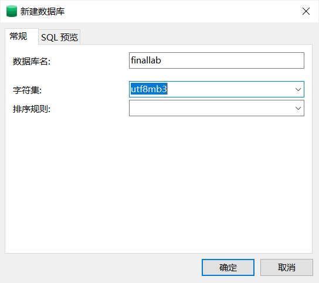

# 选题

## 电子钱包

主要实现功能：
- 客户之间进行交易、查看交易详情、统计查看等等
  - 身份验证、统计交易
- 管理员查看交易记录
- 登录验证。。

客户：存钱、取钱、交易（收、发）、查看账户的交易记录、<申请注销>、用户限额

经理：管理客户（开户、修改密码、注销、提升限额），查看记录，查看月流水

通用：登录验证（账号、密码、手机号）。

# 分工

1. 文档+主程序：主程序（gui、调用接口），写文档；
2. 接口部分+ppt：程序访问数据库的函数、展示ppt、部分数据库实现；
3. 数据库部分：部分数据库实现

数据库实现包含：数据库设计；表、用户、权限、触发器，初始化一些数据等等。

分工可以再调整，感觉数据库部分可能会多一点，最后每个人可能都会写一点文档、ppt。

前端：实现展示框架、调用接口(陈瑞祺)
后端：数据库设计、*(实现、接口实现)*
报告：文档、ppt

# 数据库设计

以功能为导向：

**实体集：**

1. **账户**：账号，密码，手机号，邮箱
2. **客户**：客户ID，姓名，余额，限额（单日）
3. **经理**：经理ID，姓名
4. **交易**：交易ID，发起客户，接收客户，交易状态，金额

**关系集：**

- 账户-客户：拥有
- 账户-经理：拥有
- 客户-交易：修改交易状态（发起、接收、拒绝、撤销）、修改时间
- 经理-交易：强制回退交易、修改时间、
- 经理-客户：开户、销户、修改密码、修改限额
- 经理不能修改自己的密码，只能通过后台的数据库管理员。

**约束**：
- 账户：
  - 账号为主键
  - 密码不能为空。
- 客户：
  - 客户id为主键
- 经理：
  - 经理id为主键
- 交易：
  - 交易id为主键

# 开发日志

新建数据库，用于本次实验：

使用pymysql库实现python访问数据库。

# HTML & Python

使用FLask作为前后端交互的方法，falsk库创建一个简单的Web服务器，可以加载多个html页面。当html向服务器发送get请求时，flask可以返回python函数的结果。因此，我们的实现方法为：
- 运行flask创建服务器；
- 服务器运行不同的html页面；
- html页面用于用户操作，当需要访问数据库时，向服务器发送get请求，服务器将结果返回。

## 需求的html

- 首页：因为我们功能很少，所以直接做一个登录页：账号、密码登录即可。
- 登录后：
  - 客户：查看是否有待完成的交易、发起交易
  - 经理：查看客户信息（不能看密码）、修改客户密码（需要客户预留验证方式的验证，我们不可能真做验证码确认，可以直接改）、查看流水（当日、本月）