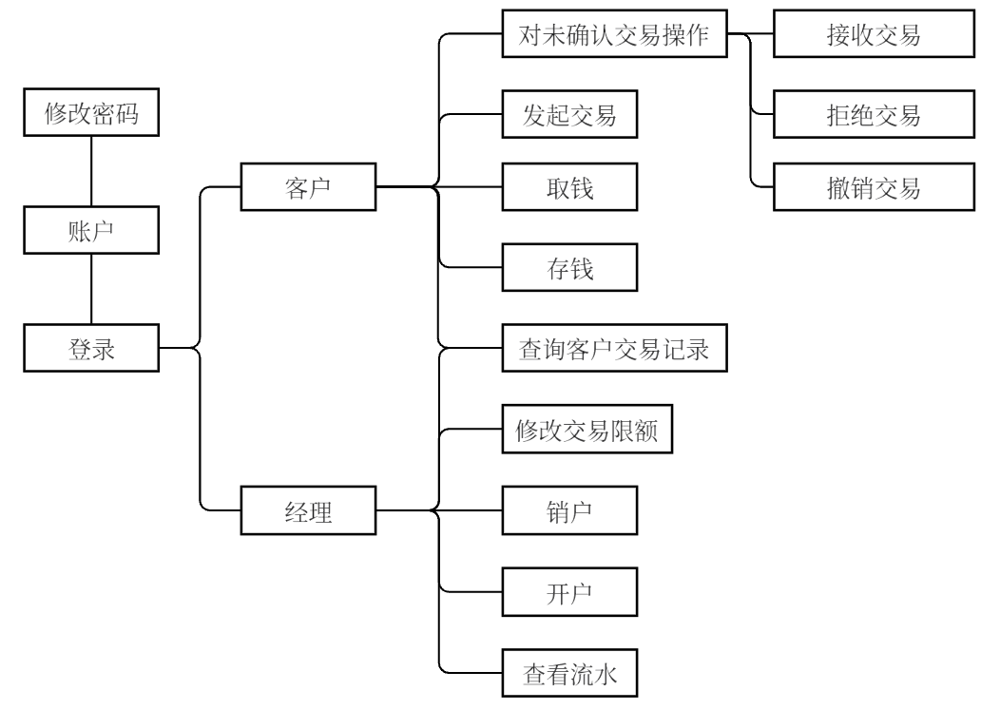

# 开发日志

新建数据库，用于本次实验：

使用pymysql库实现python访问数据库。

# 测试

1. 存、取、转账负数
2. 流水有点问题
3. 给自己转账

# 录屏任务

- 登录页：
  - 登陆成功、密码错误、账户已注销（出现过的account_id，关联了customer，但是没有账号）、账号不存在（从来没有出现过的account_id）。
- 密码修改页：
  - 修改一个密码：
  - 查看验证码
  - 验证码过期效果
- 客户页：
  - 客户存钱、取钱：在这步展示超出限额/余额的效果
  - 交易：发起三个，查询订单然后撤销一个；
  - 在另一个账户上确认，注意展示余额变化的效果。
- 经理：
  - 展示流水变化
  - 开户：
  - 销户：
  - 查看指定用户的交易记录：可以是刚刚的两个用户。
  - 修改限额：可以重登账户/在另一个浏览器刷新，展示效果。

